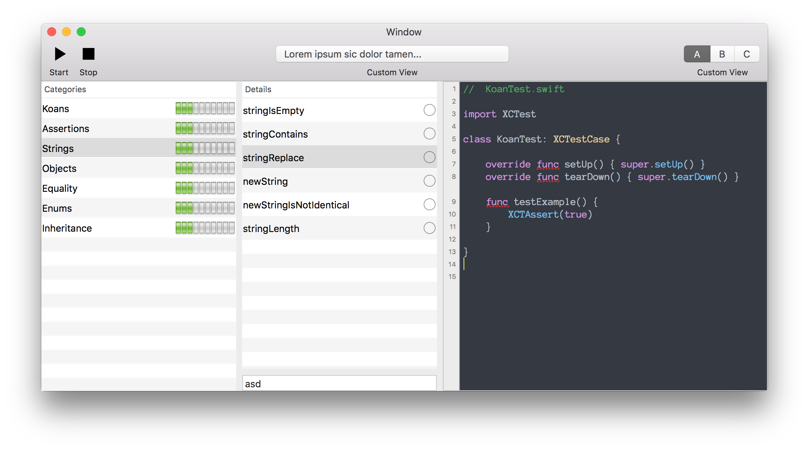

# Swift Koan
A framework and lessons to **learn Swift syntax** and idioms in a logical sequence.

	***     not yet finished! :( 				        ***
	***     feel free to help me finish this project!   ***

---

#####KoanUI interface:  

##Workspace organization

- **KoanUI** : KoanUI is the UI interface of the "*game*".  
Test cases are divided in Categories (left) and Single test (center), loaded from a Json file, with completion progress on both. On the right, you can write correct tests, click Run and go to next one!  
	
- **KoanTestcase** : Are the test cases of *KoanUI game*.

- **KoanCMD** : A set of command line utilities to test/run project, stats, etc...

- **OysterKit** : Is a syntax colorer framework.

##Why?
Because i've used Java Koan test project, that i like a lot: [https://github.com/matyb/java-koans](https://github.com/matyb/java-koans) and i want to the a similar tool in and for Swift.

##Extras
Simple test case:  

	import XCTest
	
	class TestZone : XCTestCase {
	
	    override func setUp() { super.setUp() }
	    override func tearDown() { super.tearDown() }
	
	    //@XTPasky: sample description
	    func testSum()
	    {
	        XCTAssertTrue(X.XY)
	    }
	
	    //@XTPasky:
	    func testBasicIf()
	    {
	        var x : Int = 1
	        if (true) {
	            x += 1;
	        }
	        XCTAssertEqual(x, X.XX)
	    }
	
	}

The string `//@XTPasky` is used to recognize from project (CMD) the tests.  

---

Using a continuous integration test tool, named `xctool`, created by facebook devs, we can launch in background and from command line, the test validator:

`xctool -scheme UnitTest test -parallelize -reporter plain:/tmp/koan-output.txt`

xctool produce output similar this:  

	ludmilla:KoanCMD pasky$ xctool -scheme KoanCMDTests test -parallelize
	[Info] Loading settings for scheme 'KoanCMDTests' ... (1175 ms)
	
	=== TEST ===
	
	  xcodebuild build build
	    CommandLine / UnitTest (Debug)
	      ✓ Check dependencies (48 ms)
	      ✓ Compile UnitTest.swift (13057 ms)
	      ✓ Compile TestZone.swift (10371 ms)
	      ✓ Compile Config.swift (10791 ms)
	      ✓ Merge UnitTest.swiftmodule (4092 ms)
	      ✓ Compile UnitTest.swift (13057 ms)
	      ✓ Compile UnitTest.swift (13057 ms)
	      ✓ Compile TestZone.swift (10371 ms)
	      ✓ Compile TestZone.swift (10371 ms)
	      ✓ Compile Config.swift (10791 ms)
	      ✓ Compile Config.swift (10791 ms)
	      ✓ Compile Swift source files (4110 ms)
	      0 errored, 0 warning (4169 ms)
	
	
	  [Info] Collecting info for testables... (727 ms)
	  [Info] Starting UnitTest.xctest (bucket #1, 4 tests) (0 ms)
	  run-test UnitTest.xctest (macosx10.11, My Mac, logic-test)
	      -[TestZone testBasicIf]
	━━━━━━━━━━━━━━━━━━━━━━━━━━━━━━━━━━━━━━━━━━━━━━━━━━━━━━━━━━━━━━━━━━━━━━━━━━━━━━━━━━━━━━━━━━━━━━━━━━━━━━━━━━━━━━━━━━━━━━━━━━━━━━━━━━━━━━━━━━━━━━━━━━━━━
	/Volumes/DATA/Dropbox/Work/Personal/Koan-Swift/KoanCMD/UnitTest/TestZone.swift:29: XCTAssertEqual failed: ("Optional(2)") is not equal to ("Optional(-1)") - :
	26         if (true) {
	27             x += 1;
	28         }
	29         XCTAssertEqual(x, X.XX)
	           ~~~~~~~~~~~~~~~~~~~~~~~
	30     }
	31 
	━━━━┳━━━━━━━━━━━━━━━━━━━━━━━━━━━━━━━━━━━━━━━━━━━━━━━━━━━━━━━━━━━━━━━━━━━━━━━━━━━━━━━━━━━━━━━━━━━━━━━━━━━━━━━━━━━━━━━━━━━━━━━━━━━━━━━━━━━━━━━━━━━━━━━━
	    ✗ -[TestZone testBasicIf] (3 ms) (0)
	      -[TestZone testSum]
	━━━━━━━━━━━━━━━━━━━━━━━━━━━━━━━━━━━━━━━━━━━━━━━━━━━━━━━━━━━━━━━━━━━━━━━━━━━━━━━━━━━━━━━━━━━━━━━━━━━━━━━━━━━━━━━━━━━━━━━━━━━━━━━━━━━━━━━━━━━━━━━━━━━━━
	/Volumes/DATA/Dropbox/Work/Personal/Koan-Swift/KoanCMD/UnitTest/TestZone.swift:19: XCTAssertTrue failed - :
	16     //@XTPasky: sample description
	17     func testSum()
	18     {
	19         XCTAssertTrue(X.XY)
	           ~~~~~~~~~~~~~~~~~~~
	20     }
	21 
	━━━━┳━━━━━━━━━━━━━━━━━━━━━━━━━━━━━━━━━━━━━━━━━━━━━━━━━━━━━━━━━━━━━━━━━━━━━━━━━━━━━━━━━━━━━━━━━━━━━━━━━━━━━━━━━━━━━━━━━━━━━━━━━━━━━━━━━━━━━━━━━━━━━━━━
	    ✗ -[TestZone testSum] (0 ms) (1)
	    ✓ -[UnitTest testExample] (0 ms)
	    ✓ -[UnitTest testExampleB] (0 ms)
	    2 passed, 2 failed, 0 errored, 4 total (4 ms)
	
	
	Failures:
	
	  0) -[TestZone testBasicIf] (UnitTest.xctest)
	━━━━━━━━━━━━━━━━━━━━━━━━━━━━━━━━━━━━━━━━━━━━━━━━━━━━━━━━━━━━━━━━━━━━━━━━━━━━━━━━━━━━━━━━━━━━━━━━━━━━━━━━━━━━━━━━━━━━━━━━━━━━━━━━━━━━━━━━━━━━━━━━━━━━━
	
	/Volumes/DATA/Dropbox/Work/Personal/Koan-Swift/KoanCMD/UnitTest/TestZone.swift:29: XCTAssertEqual failed: ("Optional(2)") is not equal to ("Optional(-1)") - :
	26         if (true) {
	27             x += 1;
	28         }
	29         XCTAssertEqual(x, X.XX)
	           ~~~~~~~~~~~~~~~~~~~~~~~
	30     }
	31 
	━━━━━━━━━━━━━━━━━━━━━━━━━━━━━━━━━━━━━━━━━━━━━━━━━━━━━━━━━━━━━━━━━━━━━━━━━━━━━━━━━━━━━━━━━━━━━━━━━━━━━━━━━━━━━━━━━━━━━━━━━━━━━━━━━━━━━━━━━━━━━━━━━━━━━
	
	  1) -[TestZone testSum] (UnitTest.xctest)
	━━━━━━━━━━━━━━━━━━━━━━━━━━━━━━━━━━━━━━━━━━━━━━━━━━━━━━━━━━━━━━━━━━━━━━━━━━━━━━━━━━━━━━━━━━━━━━━━━━━━━━━━━━━━━━━━━━━━━━━━━━━━━━━━━━━━━━━━━━━━━━━━━━━━━
	
	/Volumes/DATA/Dropbox/Work/Personal/Koan-Swift/KoanCMD/UnitTest/TestZone.swift:19: XCTAssertTrue failed - :
	16     //@XTPasky: sample description
	17     func testSum()
	18     {
	19         XCTAssertTrue(X.XY)
	           ~~~~~~~~~~~~~~~~~~~
	20     }
	21 
	━━━━━━━━━━━━━━━━━━━━━━━━━━━━━━━━━━━━━━━━━━━━━━━━━━━━━━━━━━━━━━━━━━━━━━━━━━━━━━━━━━━━━━━━━━━━━━━━━━━━━━━━━━━━━━━━━━━━━━━━━━━━━━━━━━━━━━━━━━━━━━━━━━━━━
	
	** TEST FAILED: 2 passed, 2 failed, 0 errored, 4 total ** (6077 ms)
	
	ludmilla:KoanCMD pasky$ 

Redirecting the output to a file, you can read by a simple parser the lines that you want, like `KoanCMD` produce in console:

	tot  :  0
	tot  :  2
	names:  ["func testSum()", "func testBasicIf()"]
	** TEST FAILED: 2 passed, 3 failed, 0 errored, 5 total ** (8226 ms)
	FAILED!
	PASSED:  2
	FAILED:  3
	ERRORS:  0
	TOTALS:  5
	Test faileds:  -[TestZone testBasicIf] (6 ms) (0)
	Test faileds:  -[TestZone testDiv] (0 ms) (1)
	Test faileds:  -[TestZone testSum] (0 ms) (2)
	Program ended with exit code: 0

**KoanUI** should run **xctool** and increment progress on the UI.

---
Categories / Single tests are loaded from a local Json that follow this schema:  

	{
		"categories": {
			"Koans": [{
				"test-name": "test-file"
			}, {
				"test-name": "test-file"
			}],
			"Strings": [{
				"newString": "aaaa"
			}, {
				"newStringIsNotIdentical": "bbbb"
			}, {
				"stringIsEmpty": "ccccc"
			}]
		}
	}
	

##Externals libs
- **[xctool](https://github.com/facebook/xctool)** (from facebook developers)
- **[LineTextView](https://github.com/MrNoodle/NoodleKit)**
- **[OysterKit](https://github.com/SwiftStudies/OysterKit)**

##Requirements
- Xcode (Autolayout / Swift)
- Mac OSX
- Patience

##Todo
- complete **KoanUI** to read/write all data
- run **xctool** from UI
- validate / save / load user progress
- fix OysterKit syntax color

[albertopasca.it](http://www.albertopasca.it)